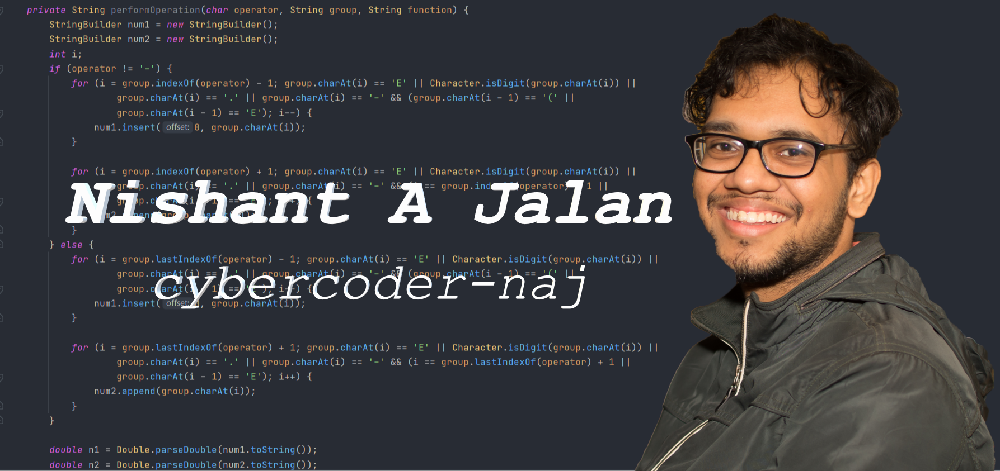

# Hello, World! My name is Nishant - aka [cybercoder-naj][github] 👋

## 👌 I'm a Student, Musician, Developer, and Teacher

- 😎 I've developed many Android applications, some of which are on the Play Store.
- 🎓 I'm an [Oracle Certified Java Professional][badge].
- 🌐 Full Stack web applications with JavaScript/Typescript.
- 👨‍🏫 I teach CS and Math on [Schoolhouse.world][shw].
- 🎶 I love rock music: Queen and Bon Jovi Fan; and I play the synthesizer.

### 🤝 Connect with me

[][github]
[][linkedin]
[][stackoverflow] \
[][playstore]
[][medium]

### 🧠 Languages and Tools

---

[][github]

---

### ⚡ Recent Activity

<!--START_SECTION:activity-->
1. 💪 Opened PR [#6136](https://github.com/EddieHubCommunity/LinkFree/pull/6136) in [EddieHubCommunity/LinkFree](https://github.com/EddieHubCommunity/LinkFree)
2. ❌ Closed PR [#1](https://github.com/cybercoder-naj/LinkFree/pull/1) in [cybercoder-naj/LinkFree](https://github.com/cybercoder-naj/LinkFree)
3. 💪 Opened PR [#1](https://github.com/cybercoder-naj/LinkFree/pull/1) in [cybercoder-naj/LinkFree](https://github.com/cybercoder-naj/LinkFree)
<!--END_SECTION:activity-->

---

### 📝 Medium Articles

<!-- MEDIUM:START -->
- [Why Java Was Loved 20 Years Ago and Disliked Today](https://medium.com/codex/why-java-was-loved-20-years-ago-and-disliked-today-ef45f7a53740?source=rss-ee489d74c1af------2)
- [This Algorithm is faster than Merge Sort](https://medium.com/codex/this-algorithm-is-faster-than-merge-sort-12564541a425?source=rss-ee489d74c1af------2)
- [It’s 2023 — Why do I still use Vim?](https://medium.com/codex/its-2023-why-do-i-still-use-vim-6d4e51587d4e?source=rss-ee489d74c1af------2)
- [Programming Principles They Don’t Teach You In School](https://medium.com/codex/programming-principles-they-dont-teach-you-in-school-7c14b21cdf64?source=rss-ee489d74c1af------2)
- [Rust 101 — Everything you need to know about Rust](https://medium.com/codex/rust-101-everything-you-need-to-know-about-rust-f3dd0ae99f4c?source=rss-ee489d74c1af------2)
<!-- MEDIUM:END -->

---

[][github]

[github]: https://github.com/cybercoder-naj
[badge]: https://www.youracclaim.com/badges/79bbfbe8-cdf4-4d8d-b1ba-57efaa5c331d/linked_in_profile
[youtube]: https://www.youtube.com/channel/UCPoU-LKr3XG0IujgCFFt4_A
[linkedin]: https://www.linkedin.com/in/nishant-aanjaney-jalan-3b7659191/
[telegram]: https://t.me/cybercoder_naj
[stackoverflow]: https://stackoverflow.com/users/11292068/nishant-jalan
[hackerrank]: https://www.hackerrank.com/cybercoder_nish1
[playstore]: https://play.google.com/store/apps/developer?id=Nishant+Aanjaney+Jalan
[shw]: https://schoolhouse.world/u/50780?ref=u-z1aylccz1vjxlx?celebrate
[medium]: https://www.medium.com/@cybercoder.naj
